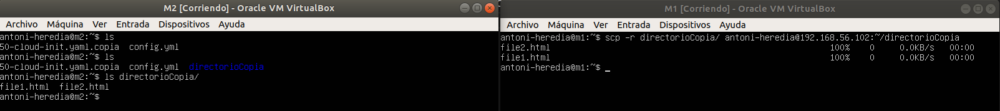
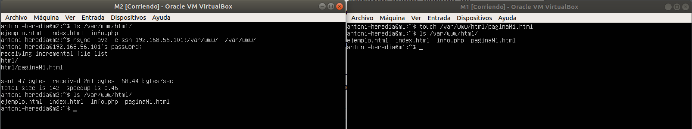
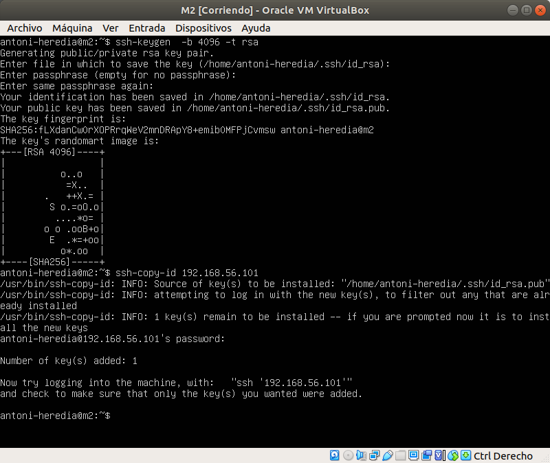
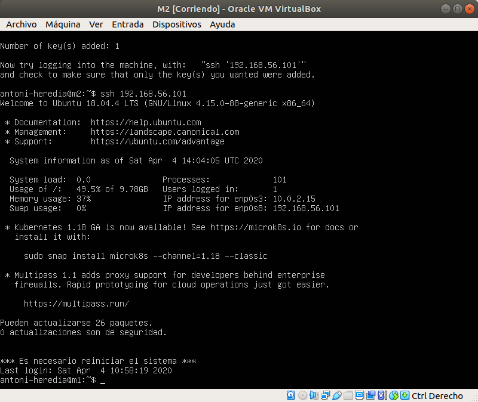
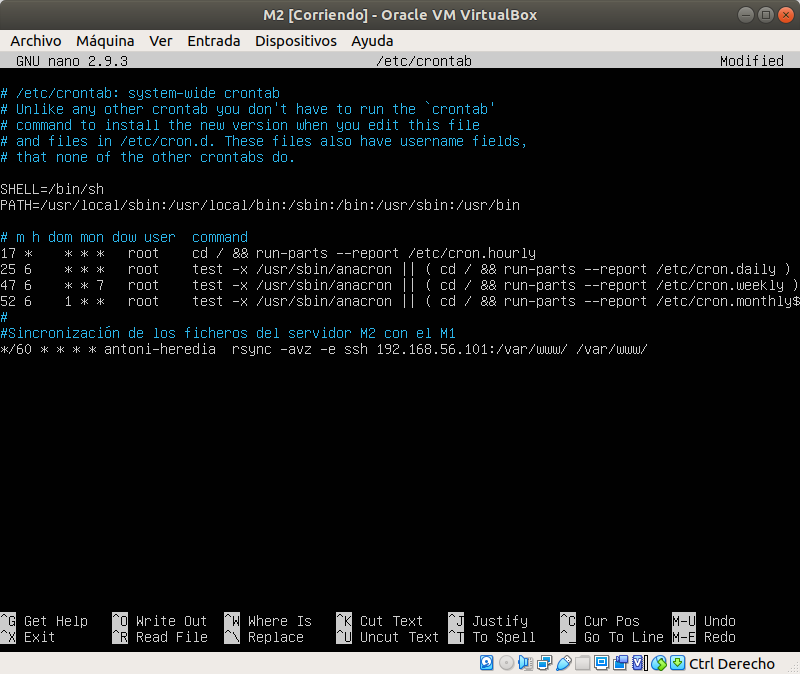
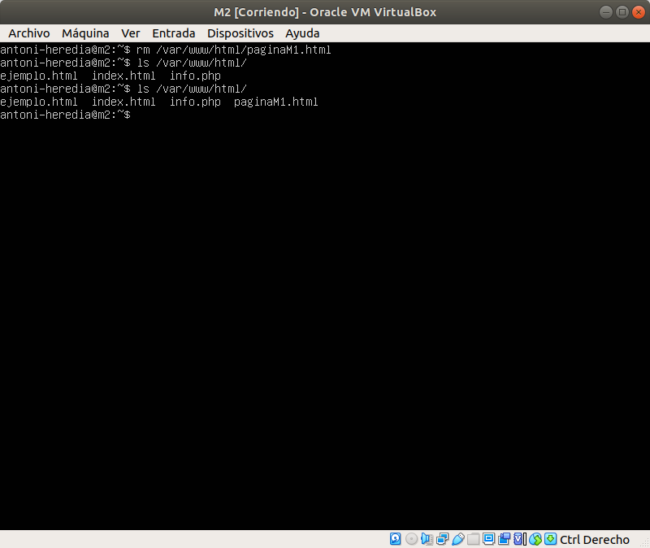

# Practica 2
## Autor: Antonio Jesús Heredia Castillo
### 1. Probar el funcionamiento de la copia de archivos por ssh
A pesar de que yo había usado en la practica anterior scp para copiar algunos ficheros. Volveré a mostrar el funcionamiento del mismo en esta practica.  

Como podemos ver en la siguiente imagen, primero en la maquina __M2__ no tenemos el directorio "directorioCopia" ni los ficheros que tiene el directorio. Después de realizar el comando en __M1__ tenemos todos los ficheros copiados. 

En la captura de pantalla no se puede ver como pide la contraseña pero esto se debe a que se me olvido a realizar la captura de pantalla cuando lo hice por primera vez y la volví a realizar después de configurar la conexión ssh mediante RSA.

### 2. Clonado de una carpeta entre las dos máquinas

Para esto usaremos la herramienta __rsync__.Primero tenemos que instalarla con:
```console
sudo apt install rsync
```
Una vez tenemos esta herramienta es muy fácil de usar, como podemos ver en la siguiente captura de pantalla:


Se ejecuta desde la maquina a la que queremos que se sincronicen los ficheros. Como yo quiero que __M2__ se sincronice con __M1__ lo lanzare desde __M2__. En la imagen podemos ver como se trae el fichero "paginaM1.html" que no existía anteriormente. 

### 3. Configuración de ssh para acceder sin que solicite contraseña.

Aunque esta acción la he realizado en las dos maquinas para poder acceder de una a otra sin introducir la contraseña solo voy a mostrar los pasos desde  __M2__.
Es tan fácil como generar nuestro par de claves, la privada y la publica, con  el siguiente comando:
```console
ssh-keygen -b 4096 -t rsa
```

Una vez generado se copia fácilmente con:
```console
ssh-copy-id 192.168.56.101
```
El cual nos pedirá la contraseña y añadirá nuestra clave publica. Y ya nos podremos conectar mediante ssh sin que nos pida la contraseña.
```console
ssh 192.168.56.101
```


### 4. Establecer una tarea en cron que se ejecute cada hora para mantener actualizado el contenido del directorio /var/www entre las dos máquinas

Para realizar esto tendremos que editar el fichero crontab, añadiendo la ultima línea que aparece en la siguiente imagen:

La ultima línea indica que se ejecute el comando __rsync__ todos los días a todas horas, cada 60 minutos. También podría haber indicado que se ejecutara cada hora directamente. 
En la siguiente imagen podemos ver como ha funcionado el crontab, aunque para poder realizar la memoria sin tener que esperar demasiado lo cambie a que se ejecutara cada minuto. 
