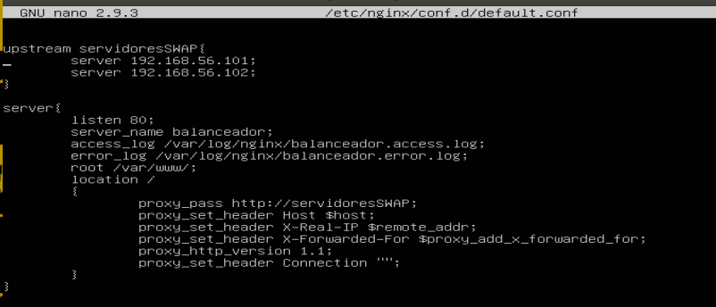
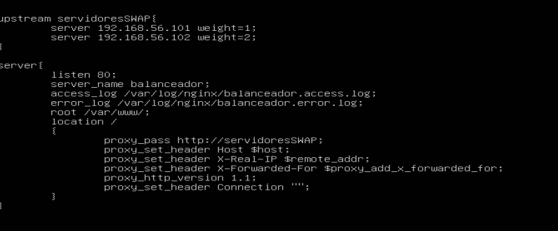
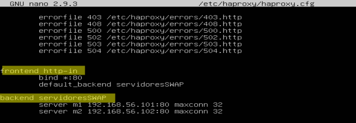
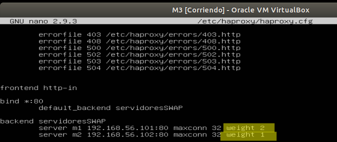
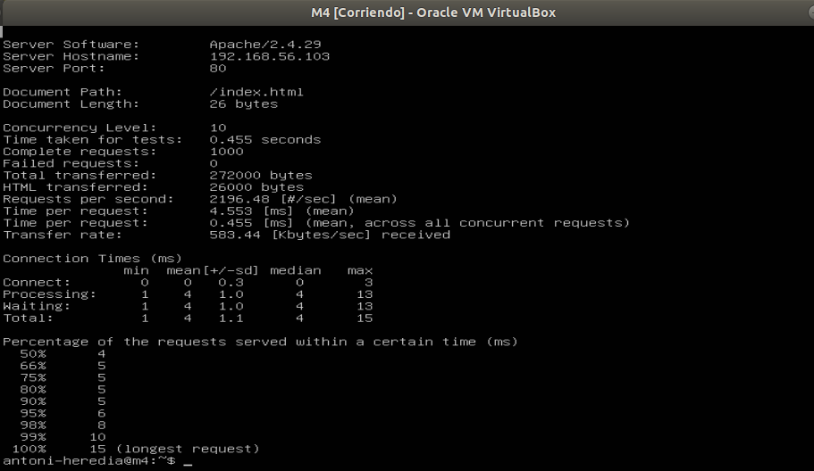

# Practica 3
## Autor: Antonio Jesús Heredia Castillo
### Nginx
Lo primero que vamos a probar a probar es la configuración mínima de nginx como balanceador de carga con dos maquinas. Para ello tenemos el siguiente fichero de configuración:

Con esto conseguimos que las diferentes peticiones se repartan entre los dos servidores que tenemos configurados como podemos ver en la siguiente captura:

Como podemos ver se reparten una petición para cada servidor.

La siguiente configuración que vamos a probar es dando pesos a los diferentes servidores. Con esto podemos conseguir que cada servidor reciba diferente carga de trabajo según sus capacidades. La configuración la realice distinta al revés de lo que pedía el enunciado (lo lei después esa parte), por lo tanto mi __M2__ esta puesto como si tuviera el doble de capacidad que __M1__.

Y como podemos ver en la siguiente imagen las peticiones se reparten 1/3 para el servidor __M1__ y 2/3 al servidor __M2__.


Otra configuración que puede ser interesante es que todas las peticiones provenientes de la misma IP se redirecciona al mismo servidor. Esto se consigue usando la directiva __ip_hash__ como podemos ver en la siguiente imagen:

Y obtenemos como resultado que todas las peticiones enviadas con la misma maquina van al mismo servidor:


Una herramienta interesantes para realizar Benchmark, puede ser __Apache Benchmark__. Esta herramienta nos sirve para comprobar el rendimiento de un servidor web. Para ello realiza múltiples peticiones a la pagina que le indiquemos. Se ejecuta fácilmente con el comando 
```console
antoni-heredia@m4:~$ ab -n 10000 -c 10 http://192.168.56.103/index.html
``` 
Con esto obtendremos el siguiente resultado por pantalla:

### Haproxy

Ahora realizare algunas configuraciones de prueba del funcionamiento de __haproxy__. El funcionamiento es muy parecido al de ningx. Simplemente tenemos que añadir unas directivas de funcionamiento en el fichero "/etc/haproxy/haproxy.cfg". Por ejemplo la siguiente:

Con esta configuración realizamos un reparto equitativo de las peticiones entre los distintos servidores. Como podemos ver en la siguiente imagen:


Como con ningx también podemos realizar un balanceo de carga que se realice según la capacidad de computo de los distintos servidores. Esto se usando usando la opción "weight". Quedara una configuración algo asi:

Con esto conseguimos que 1/3 peticiones vayan al servidor __M2__ y el 2/3 restante se dirija al servidor __M1__. 


Por ultimo realizamos el benchmark con "apache benchmark". 


### Comprobación entre los dos benchmark
En este apartado voy a ir desgranando los dos benchmark que he realizado en los dos apartados anteriores. 

Como podemos ver en ninguno de los dos casos ha fallado ni una petición. No obstante en el caso de __Haproxy__ se han podido realizar mas peticiones por segundo, exactamente 2196.48 contra las 1988.91 de __nginx__. Por lo tanto podemos estimar que Haproxy es mas rapido a la hora de resolverlas. Esto tambien lo podemos ver en el tiempo medio en que el servidor ha tardado en atender a un grupo de peticiones 4.553 ms del Haproxy versus los 5.028ms de nginx.

Ahora vamos a ver los "Connection Times" en media: 

|  |__NGINX__|__Haproxy__|
|--|--|--|
|Connect|0 | 0 |
|Porocessing| 5| 4 |
|Waiting| 5| 4 |

- Connect es el tiempo en establecer la conexión(abrir el socket)
- Processing es el tiempo que el servidor ha necesitado para porcesar la respuesta
- Waiting es el tiempo en obtener los primeros bits de la respuesta

Como podemos ver en dos de los casos Haproxy vuelve a ser el mas rapido y en el caso de abrir el socket los dos tardan 0. Por lo tanto aqui vuelve a ganar __Haproxy__.
