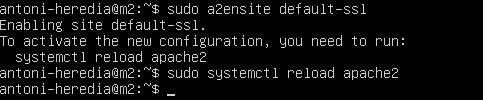

# Practica 4
## Autor: Antonio Jesús Heredia Castillo
***
### Configuración SSL
Aunque en el guión pide que se haga en __M1__, me di cuenta que lo hice primero en __M2__. No obstante el proceso es exactamente igual. Ademas como me encargo de copiar las claves tanto a __M1__ y __M3__ el resultado final es el mismo. 
\
Lo primero que hacemos es activar el modulo SSL de apache, reiniciarlo y crear la capreta donde vamos a guardar los ficheros.
\

\
Cuando estemos generando el certificado introduciremos los siguientes datos:
\

\
Una vez generado el certificado tenemos que indicar a apache donde se encuentra el mismo, ya que la ruta que trae por defecto no es la de nuestro certificado:
\

\
Ahora solo tenemos que activar el SLL por defecto y recargar la configuración:
\

\
Cuando entramos con el navegador nos dice si "confiamos en el sitio" tendremos que decir que si, esto se debe a que el certificado no esta firmado por alguna empresa reconocida. Y al ver el certificado podemos ver que son los datos que nosotros añadimos.
\

\
Ahora para poder tener el mismo certificado en __M1__ y __M3__, haremos uso de scp. Con ella copiaremos el certificado y la clave a ambas maquinas como se puede ver en la siguiente imagen:
\

\
En la maquina __M1__ deberemos mover ambos ficheros al siguiente directorio:
\

\
En el caso de la maquina __M3__ lo pondremos en el siguiente directorio:
\

\
Podemos ver que si intentamos acceder a la maquina __M3__ antes de la configuración, aunque __M1__ y __M2__ esten ya configurados para usar SSL, no nos va a dejar acceder.
\

\
En la maquina __M1__ el proceso para configurar Apache es el mismo que el que hemos descrito anteriormente. En el caso de __M3__ como usa NGINX para balancear la carga si cambia la configuración. Tendremos que modificar el fichero "/etc/nginx/conf.d/default.conf" y añadir un servidor nuevo. Quedando la configuración algo tal que asi:
\

\
Indicamos que escuche en el puerto 443, el por defecto para usar HTTPs, y donde están ubicados los ficheros del certificado. Ahora lo unico que nos queda es reiniciar NGINX para que coja la nueva configuración y listo.

\ 

\
Ahora ya podemos acceder tanto a __M1__ como a __M2__ desde la maquina __M3__. 
\

### Cortafuegos
Primero, como pide en la practica vamos a realizar una configuración muy básica con IPTABLES en la maquina __M1__. Solo permitiremos el acceso web por el puerto 80 y 430 y ademas el acceso por SSH, ya que ese puerto también se suele dejar abierto para poder configurar la maquina de forma remota. Para ello usaremos el siguiente script:
\
 
\
Le damos permisos de ejecución al script y lo ejecutamos como administrador:
 
\
Y podemos ver si esta funcionando bien con el comando netstat:
\
 
\
Para el extra que se pide en la practica lo he conseguido a medias. Ya si he realizado que __M1__ y __M2__ reciban solo datos desde __M3__ que es el balanceador, pero no he conseguido que el balanceador, recibiendo peticiones solo por el puerto 80 o 443, pueda servir las paginas web de las otras dos maquinas. 

Por lo tanto lo que he realizado es que __M3__ reciba y envíe a todas las maquinas con el siguiente script:
\

\
Y para que __M1__ y __M2__ solo reciban desde __M3__ el script es el siguiente:
\

\
Y como podemos ver si intentamos acceder directamente a cualquiera de las maquinas el navegador se queda "pensando":
\

\
Y en cambio si intentamos acceder desde el balanceador funciona perfectamente:
\

