# Practica 4
## Autor: Antonio Jesús Heredia Castillo
***
### Creación de la base de datos
Para crear la base de datos, debemos tener instalado __mysql__. Cosa que ya realizamos en la __P1__. Lo primero que tenemos que hacer conectarnos a la base de datos con 
```
sudo mysql -u root -p
```
y despues crear una base de datos llamada __estudiante__ (que estara vacia) de la siguiente manera:

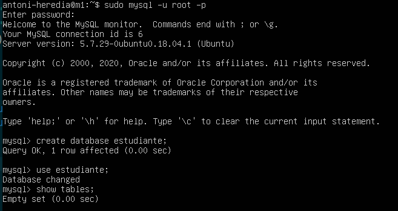

En esa base de datos crearemos una tabla llamada __datos__ que es la que usaremos para insertar datos y realizar las pruebas:

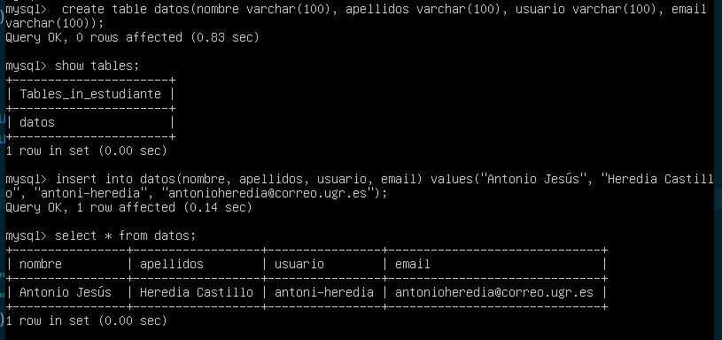

En la imagen anterior podemos ver como añado mis datos y para ver que todo funciona de forma correcta realizamos un __select__. 

### Realizar copia de seguridad con mysqldump
Lo primero que tenemos que realizar es cerrar todas las tablas que haya abiertas y bloquear el acceso.

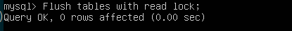

Despues tenemos que salir de mysql y hacer uso de __mysqldump__ para poder realizar la copia de la base de datos estudiante con todos sus datos guardándola en __/tmp/estudiante.sql__:

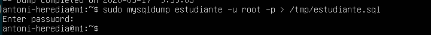

La copiamos con __scp__ a la maquina __M2__ con el comando:
```
sudo scp /tmp/estudiante.sql antoni-heredia@192.168.56.102:/tmp/estudiante.sql
```
Y se guardara en la carpeta de __M2__ que le hemos indicado:

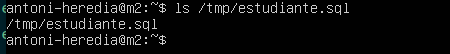


Para poder cargar la copia de seguridad de esa base de datos, primero tenemos que crearla:

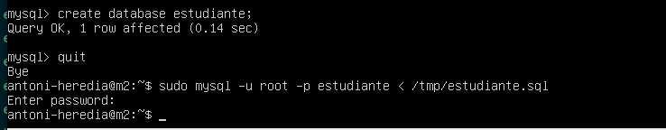

Y una vez creada podemos "cargarla" como vemos en la imagen anterior. Y tenemos los datos en la maquina __M2__.

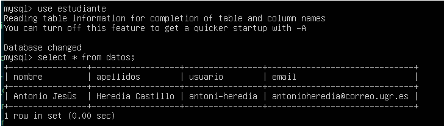

### Realizar copia de seguridad con configuración __Maestro-Esclavo__
Lo primero que tenemos que realizar es modificar el fichero ```/etc/mysql/mysql.conf.d/mysqld.cnf``` de la maquina __M1__. Aunque no se vea en la imagen, tambien esta comentada la linea ```bind-addres 127.0.0.1```.

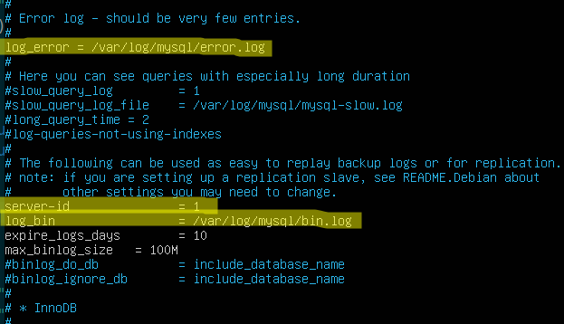

Lo mismo realizaremos en __M2__ pero cambiando el __server-id__ a 2. 

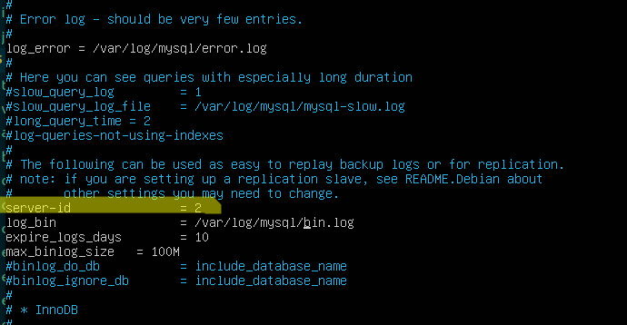

Tendremos que reiniciar __mysql__ en las dos maquinas con:
```
sudo service mysql restart
```
Ahora tendremos que configurar __M1__ para que haga de servidor maestro, creando el usuario __esclavo__ y concediéndole permisos para replicar la base de datos.

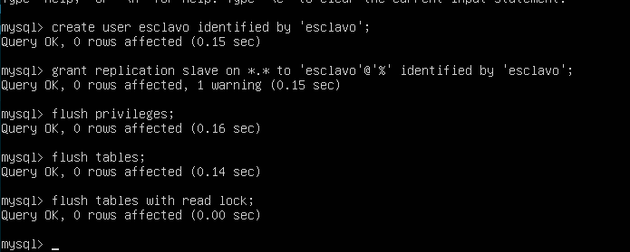

También tenemos que recargar los privilegios desde las tablas de concesiones en la base de datos __mysql__, cerrar todas las tablas y bloquearlas (se realiza en la imagen anterior).

En la maquina __M2__ tenemos que indicarle cual sera el servidor __master__, cual es la dirección, puerto y contraseña. Ademas de cual es el fichero que copiara y su posición. Una vez realizado eso lo iniciaremos.

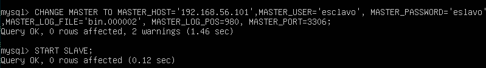

 
Ya podemos desbloquear las tablas de __M1__ y ver si ha funcionado:

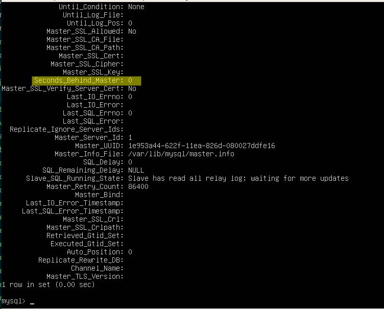

Para ver si funcionaba de forma correcta  realice una inserción de datos en __M1__ y comprobé si se replicaban los datos en __M2__.

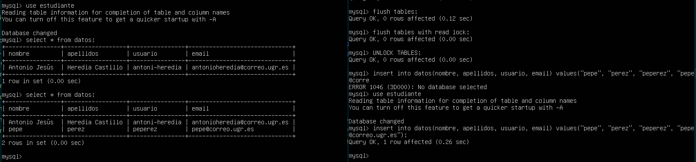

