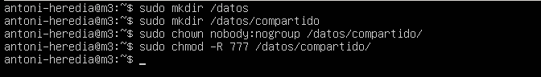
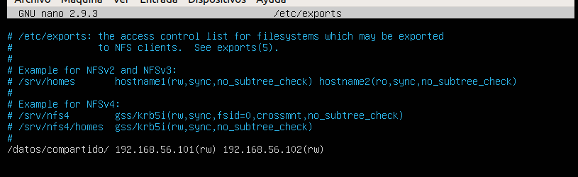
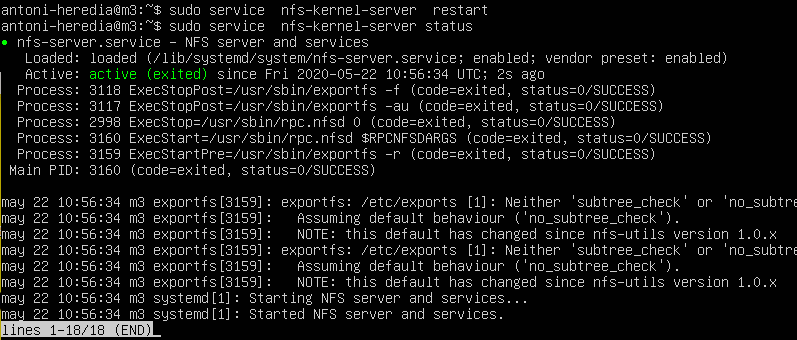
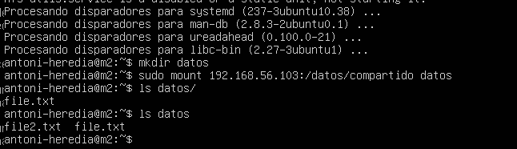
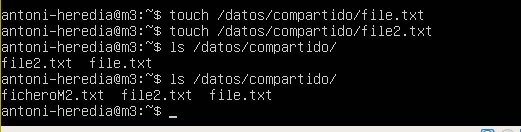
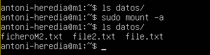
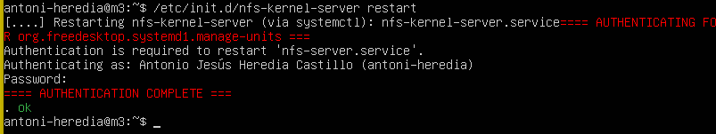
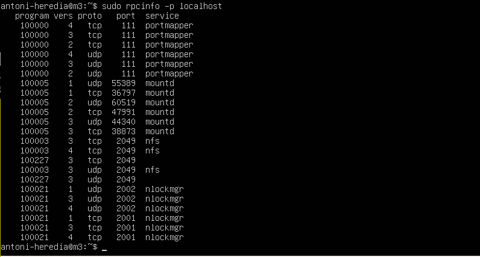
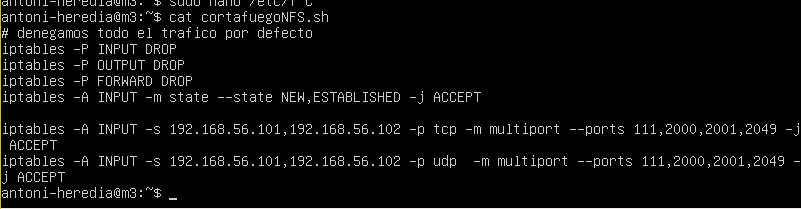
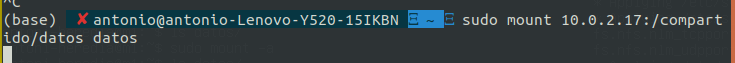

# Practica 6
## Autor: Antonio Jesús Heredia Castillo
***
### Configuración servidor
Lo primero que tenemos que realizar es crear la carpeta, cambiarla de grupo y darle los permisos oportunos.



Editamos el fichero ```/etc/export``` indicando cual es la carpeta que queremos compartir y con cuales dispositivos.



Reiniciamos el servidor NFS para que coja la nueva configuración



### Acceso a carpetas remotas

#### Metodo manual

Podemos montar las carpetas, de forma manual, siempre que queramos con el comando ```mount```, como podemos ver en la siguiente imagen se tiene acceso a los ficheros de forma instantánea. 



Como podemos ver, también puedo crear ficheros desde las maquinas clientes y aparece en la maquina servidor:



#### Proceso automatico
Para que se monte de forma automatica cuando iniciamos el servidor vale con que añadamos lo siguiente al fichero ```/etc/fstab```:

```
192.168.56.103:/datos/compartido /home/usuario/datos/ nfs auto,noatime,nolock,bg,nfsvers=3,intr,tcp,actimeo=1800 0 0
```

Para que se monete sin tener que reiniciar podemos volver a usar el comando ```mount``` con la opción ```-a```.



### Seguridad del servidor
Una vez que hemos cambiado los puertos que se nos indica en el guion, reiniciamos el servicio:



Podemos ver como los puertos son los que hemos indicado con el siguiente comando:



Luego ejecutamos el script de iptables que contiene las siguientes reglas:



Podemos ver como es imposible montar la carpeta desde otra maquina que no sean __M1__ o __M2__:



Se queda "pensando" y no funciona.

