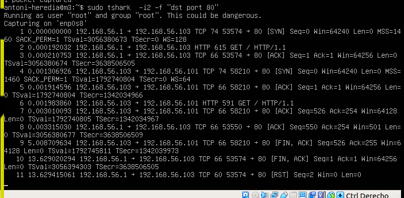
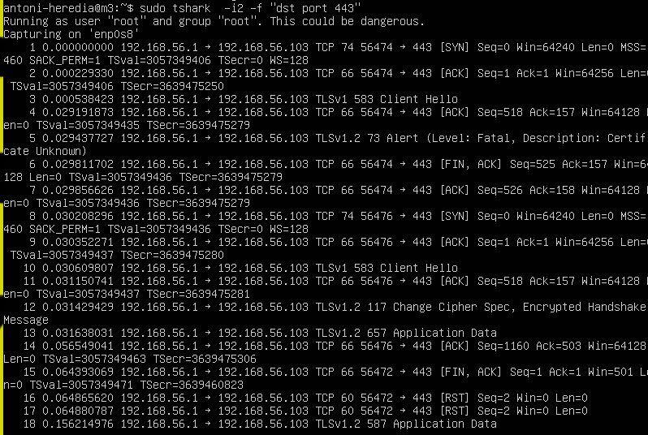
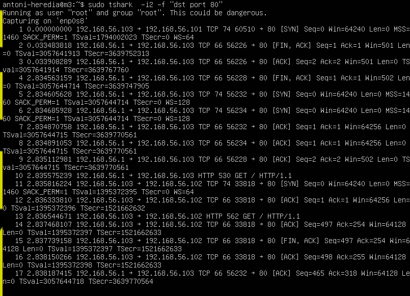

# Ejercicio T5.1: Wireshark
## Instalar Wireshark y observar cómo fluye el tráfico de red en el balanceador de la máquina M3 mientras se le hacen peticiones HTTP y HTTPS. Ejecuta al menos 3 peticiones al balanceador. Realiza un análisis de una sesión TCP (establecer conexión y cierre) de peticiones HTTP y HTTPS y escribe tus propias conclusiones. Puedes ilustrarlo con capturas de pantalla

Como __M3__ tiene un sistema operativo de server, no tiene modo grafico. Por lo tanto no he podido instalar __Wireshark__ y por lo tanto he tenido que instalar y usar __tshark__.
Adjunto las capturas de tres conexiónes que he realizado. Dos de http y una de https.
Captura 1, puerto 80.

Lo primero que el cliente quiere establecer la conexión con __syn__.  Como solo hemos capturado los paquetes del puerto 80, no podemos ver la confirmación que envía el servidor con el paquete __syn-ack__. Pero si vemos la contestación que realiza el cliente con el paquete __ack__. Se cuelan unos pocos paquetes mas y podemos ver el paquete __fin__ que indica el final de la conexión

Captura 2, puerto 443.

Captura 3, puerto 80.

