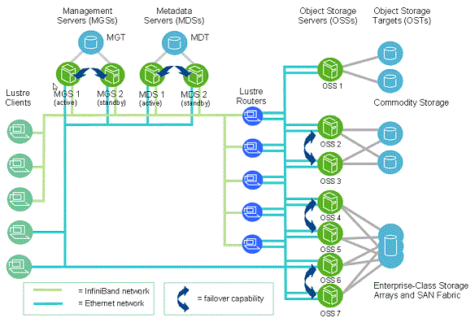

# Ejercicio T7.1: Lustre File System
## Autor: Antonio Jesús Heredia Castillo
### ¿Que es Lustre File System?

Es uns sistema de archivos distribuido pensado para clusters, usado en  los mayores supercomputadores. Ademas es Open Source. 

### ¿Qué ventajas tiene? ¿Qué arquitectura plantea?

 1. Es de código abierto, esto significa que  es barato y lo que es mas importante, que al tener acceso al código puedes realizarle cambios para adaptarlo mejor a tu sistema.
 2. Es multiplataforma, esto quiere decir que puedes instalarlo con cualquier fabricante de hardware.
 3. Tiene un elevado ancho de banda.

Aquí podemos ver el diagrama que desde [Lustre](http://lustre.org/about/) nos dan.

Lustre separa metadatos (MDS) de los datos (OSS). Realiza una escalabilidad horizontal para la entrada/salida entre los servidores y lo paraleliza gestionado los bloqueos.

El servidor de gestión (__MGS__) proporciona la información de la configuración de clientes y notifica a otros nodos los cambios. Por defecto almacena su información en un MDT.

El servidor de metadatos (__MDS__) proporciona información de los metadatos  y almacena su información en MDT.

El servidor de datos (__OSS__) proporciona E/S para los datos, almacena la información en OST.

La fuente se puede consultar [aquí](http://webserver.dmt.upm.es/zope/JS/segunda-edicion/conferencias/Presentacion_Lustre.pdf).