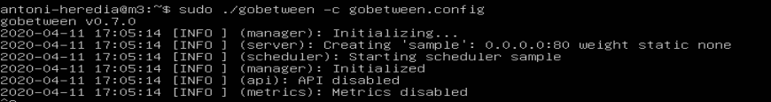
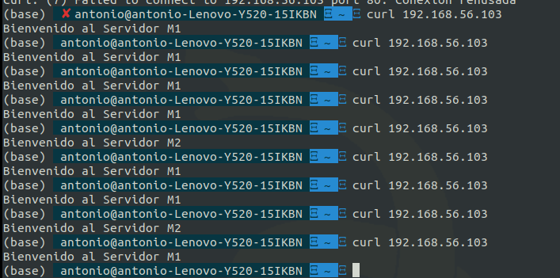

# Instalación de Gobetween y comparación con NGINX y HProxy
En mi caso, he seguido el proceso de instalación por binario explicado [aquí](https://github.com/yyyar/gobetween/wiki/Installation). 
Y el fichero de configuración es el siguiente:
```
[servers.sample]
#Indicamos que todas las peticiones al puerto 80 y protocolo tcp se van a "balancear"
bind = "0.0.0.0:80"
protocol = "tcp"

#Usaremos pesos para el balanceo de la carca entre los distintos servidores
balance = "weight"

#Permitiremos solo 1000 
max_connections = 10000

#Diferentes tiempos maximos para cotar la conexion
client_idl_timeout = "10m"
backend_idle_timeout = "10m"
backend_connection_timeout = "2s"

    #Indicamos los dos servidores y cual es el peso de cada uno
	[servers.sample.discovery]
	kind = "static"
	static_list = [
		"192.168.56.101:80 weight=2",
		"192.168.56.102:80 weight=1"

	]
```
La diferencia entre la instalación, entre gobetween y los otros dos balanceadores no creo que radique en la dificultad. Ya que los tres son bastantes sencillos. La diferencia radica a mi parecer en que de nginx y hproxy podemos encontrar mas información. No obstante toda la información que proporcionan en la pagina de gobetween es suficiente para poder usarlo. 
Otra diferencia que encuentro es que nginx y hproxy se ejecutan como si fueran servicios del sistema, en cambio gobetween tienes que ejecutarlo tu por consola como si fuera un programa normal, quedándose la terminal ejecutando ese programa (aunque esto es un problema que se puede salvar fácilmente). 

En la siguiente imagen podemos ver gobetween en funcionamiento:


Otra diferencia es que al usar el sistema de "pesos" para el balanceo es que el servidor lo coge de forma aleatoria. Es decir el 33% usara la maquina __M2__ y el 66% el servidor __M1__. Como podemos ver en la siguiente imagen:

