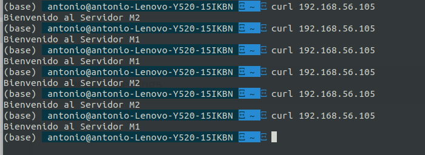

#### Instalar y configurar Zevenet
Una vez instalado Zevenet como se explica [aquí](https://www.zevenet.com/knowledge-base/community-edition/community-edition-v5-0-administration-guide/ce-v5-0-installation-guide/) (intente usar la imagen docker para ahorrar la instalación pero no fui capaz de configurarla). Durante la propia instalación debemos indicar cual es la ip de nuestra interfaz "solo-anfitrio" ( que es la que deberiamos haber puesto en la configuración de virtual box), en mi caso la ip de esta interfaz sera __192.168.56.105__ que es una de las direcciones que tengo libres. 

Nos queda configurar el balanceo de la carga. Para eso usaremos __LSLB__ (Equilibrio de carga del servicio local). 

Le ponemos un nombre cualquiera, usamos el perfil __L4XNAT__ y el puerto virtual 80.

Cuando editemos esta granja lo unico que nos queda es añadir los backends que tenemos nosotros, con su puerto y el __weight__ de cada uno. 

Y con esto ya tendríamos configurado el el balanceador de carga. 

Lo que me gusta respecto a nginx y hproxy es que al usar interfaz gráfica sabemos todas las opciones que tenemos para configurar el balanceador, pro ejemplo es muy fácil ver todos los tipos de conexiones persistentes.

Podemos ver como esta en funcionamiento en la siguiente captura de pantalla:

Otra cosa buena es que no te equivocas al escribir las distintas opciones y no te tienes que calentar la cabeza viendo de donde viene el error de configuración.

Lo que menos me gusta es justo eso también, que al usar interfaz gráfica todo el proceso puede ser mas lento. Ya que normalmente tienes que dar muchos pasos para crear algo. En cambio si se usara un simple fichero de configuración todo seria mucho mas rápido. 

En definitiva si tuviera que elegir creo que elegiría uno de los balanceadores como nginx, hproxy o gobetween. Ya que al principio cuesta acostumbrarse, pero luego lo haces todo mas rápido.
